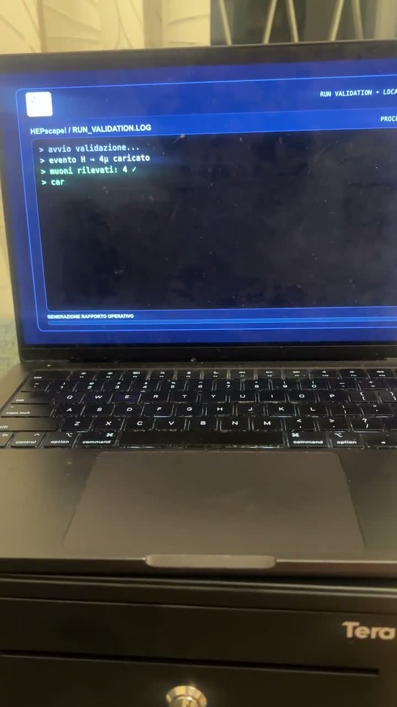

# HEPscape! — Cassetto 125

Questa cartella contiene tutto ciò che serve per far aprire il cassetto Tera Mini quando nella pagina HEPscape! viene inserito il codice **125** e l'animazione arriva a **RUN STATUS: VALIDATED**.

## Video dimostrativo

[](demo/hepscape-cassetto-demo.mp4)

**[▶ Guarda il video dimostrativo](demo/hepscape-cassetto-demo.mp4)** — durata: circa 19 secondi.

## Contenuto

- `hepscape_run_validation_v3.html`: la pagina HEPscape! completa.
- `relay_server.py`: il piccolo server locale che comunica con il trigger USB.
- `Avvia_HEPscape.command`: avvia il server con un doppio clic.
- `requirements.txt`: conferma che non servono pacchetti Python aggiuntivi.

## Hardware usato

- Cassetto portadenaro **Tera Cash Drawer** con connettore RJ12.
- Trigger USB **KX-007** per cassetto, con controller seriale **Prolific PL2303**.
- Un Mac con una porta USB disponibile (o un normale adattatore USB-C/USB, se necessario).

Il cassetto si collega al trigger tramite RJ12; il trigger si collega al Mac tramite USB. Non serve il vecchio relay DSD TECH.


### Cassetto utilizzato

| Caratteristica | Specifica verificata |
|---|---|
| Marca | Tera |
| Famiglia | Cash Drawer |
| Manuale | Ver. C01.1.03 |
| Collegamento di apertura | RJ12 verso il trigger esterno |
| Apertura | Impulso elettrico inviato dal trigger |
| Utilizzo nel progetto | Contiene il Sigillo e si apre dopo la validazione del codice 125 |

La foto del manuale non riporta un codice modello più specifico né le dimensioni del cassetto; per questo non vengono indicate misure non verificate.

### Trigger USB utilizzato

| Caratteristica | Specifica verificata |
|---|---|
| Modello | KX-007 |
| Descrizione in etichetta | USB Trigger for Cash Drawer (Driver-Free) |
| Ingresso | USB dal Mac |
| Uscita | Collegamento del cassetto RJ12 |
| Controller rilevato da macOS | Prolific PL2303 USB-Serial |
| Porta seriale | `/dev/cu.PL2303G-USBtoUART*` |
| Velocità usata | 9600 baud |
| Comando usato dal progetto | Invio del byte `X` |

La dicitura “Driver-Free” è quella stampata sul dispositivo. Su questo Mac è stato comunque necessario installare e abilitare il driver **PL2303 Serial** per far comparire la porta seriale.

## Prima preparazione su un altro Mac

1. Installa gratuitamente [PL2303 Serial dal Mac App Store](https://apps.apple.com/it/app/pl2303-serial/id1624835354).
2. Apri l'app `PL2303 Serial` almeno una volta.
3. Vai in **Impostazioni di Sistema → Generali → Elementi login ed estensioni → Estensioni driver** e abilita **Prolific**.
4. Se macOS chiede «Allow accessory to connect?», premi **Consenti**.
5. Se la porta non compare, riavvia il Mac e scollega/ricollega il trigger.
6. Collega il cassetto al trigger RJ12 e il trigger al Mac.

Il programma cerca automaticamente una porta con un nome simile a:

```text
/dev/cu.PL2303G-USBtoUART10
```

Il numero finale può cambiare: non occorre modificare alcun file.

## Installazione su Windows 7

Per **Windows 7 Home Premium a 64 bit** è disponibile un pacchetto separato nella cartella [`windows`](windows/README_WINDOWS_7.md). Include il server compatibile con le porte COM e due file da avviare con doppio clic.

Windows 7 richiede [Python 3.8.10 a 64 bit](https://www.python.org/ftp/python/3.8.10/python-3.8.10-amd64.exe); le versioni moderne di Python non sono compatibili con questo sistema.

## Avvio più facile

1. Scarica il repository sul Mac e apri la cartella.
2. Fai doppio clic su `Avvia_HEPscape.command`.
3. Lascia aperta la finestra del Terminale.
4. Apri `hepscape_run_validation_v3.html` con Chrome o Safari.
5. Inserisci **125** e avvia la sequenza.

Al termine della validazione, la pagina chiama `http://127.0.0.1:5000/open` e il cassetto si apre.

La prima volta macOS potrebbe impedire l'apertura del file `.command`. In quel caso fai clic destro sul file, scegli **Apri**, poi conferma **Apri**.

## Avvio dal Terminale

In alternativa, apri il Terminale, trascina dentro la cartella del progetto dopo aver scritto `cd `, premi Invio e poi esegui:

```bash
python3 relay_server.py
```

Quando compare questo messaggio, il sistema è pronto:

```text
HEPscape! drawer server: http://localhost:5000/open
```

Per fermare il server premi `Control-C` oppure chiudi il Terminale.

## Prova rapida

Con il server avviato e il cassetto chiuso, apri nel browser:

```text
http://localhost:5000/open
```

Se il cassetto si apre, trigger, driver e server funzionano correttamente.

## Dopo un riavvio

Non bisogna reinstallare nulla. Ricollega il trigger, fai doppio clic su `Avvia_HEPscape.command`, lascia aperto il Terminale e apri la pagina HTML.

## Come spegnere e mettere via tutto

1. Se è visibile la finestra del Terminale che esegue il server, premi `Control-C` oppure chiudila.
2. Se non è visibile alcun Terminale, apri una nuova finestra del Terminale ed esegui:

   ```bash
   pkill -f relay_server.py
   ```

3. Scollega il trigger USB dal Mac.
4. Il cavo RJ12 può rimanere collegato tra trigger e cassetto.
5. Chiudi il cassetto e, se necessario, bloccalo con la chiave.
6. Riponi insieme cassetto, trigger e cavi.

Non serve disinstallare il driver PL2303. Un eventuale processo macOS chiamato `ControlCenter` non appartiene a HEPscape! e non deve essere chiuso.

Per utilizzare nuovamente il sistema, collega il trigger USB, controlla il cavo RJ12, avvia `Avvia_HEPscape.command` e apri la pagina HTML.

## Se non funziona

- **Compare “Trigger USB non trovato”**: verifica che il trigger sia collegato, che l'estensione Prolific sia abilitata e prova a scollegarlo e ricollegarlo.
- **Il test HTTP funziona ma la pagina no**: assicurati che il Terminale con il server sia ancora aperto e ricarica la pagina HTML.
- **La porta è occupata**: probabilmente il server è già aperto in un'altra finestra; chiudi la vecchia finestra e riavvialo una sola volta.
- **Il trigger risponde ma il cassetto non si apre**: controlla il cavo RJ12 e la posizione della chiave del cassetto.
- **Dopo l'installazione del driver non appare nulla**: riavvia il Mac, abilita di nuovo l'estensione Prolific e ricollega il trigger.

## Dettagli tecnici

Il server ascolta solo sul computer locale (`127.0.0.1:5000`), espone l'endpoint `GET /open`, abilita CORS per la pagina HTML locale e invia un byte al trigger PL2303 a **9600 baud**. Non usa librerie Python esterne.
